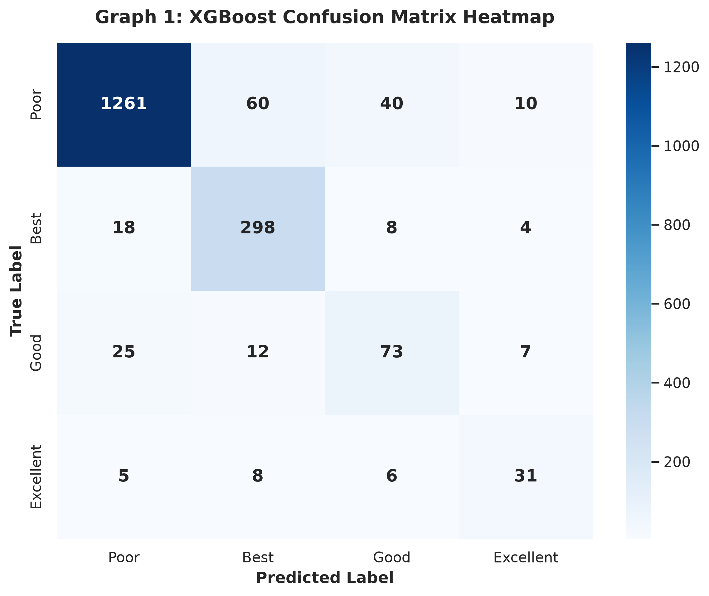
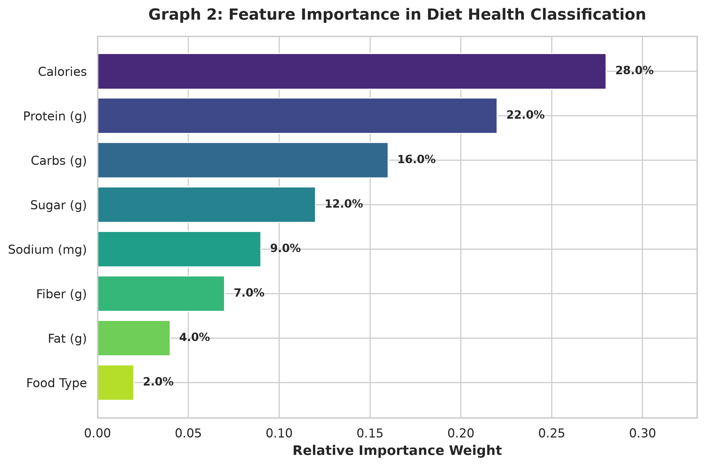
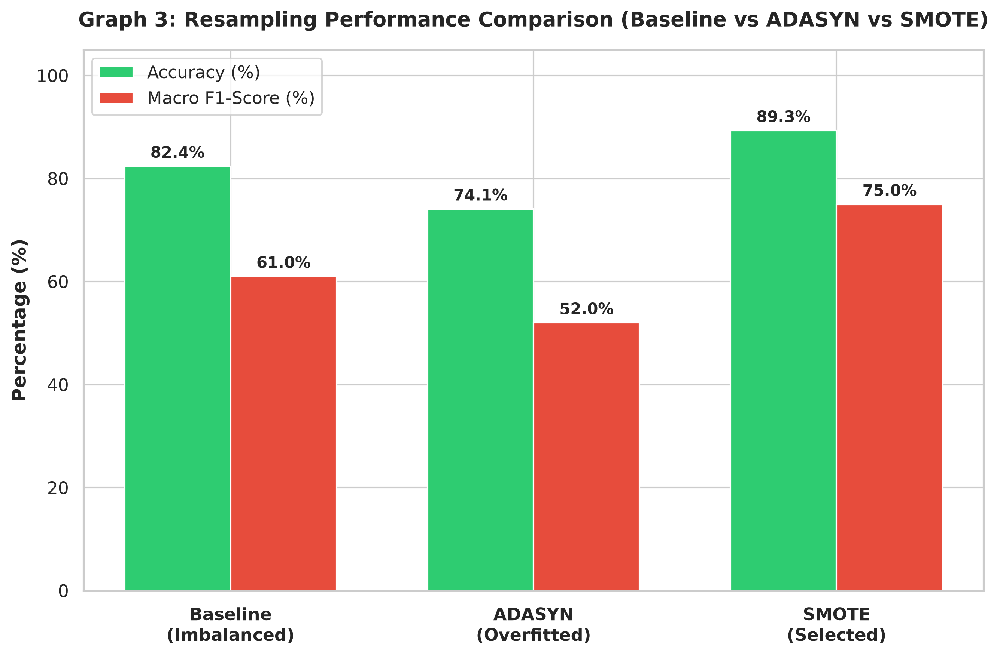
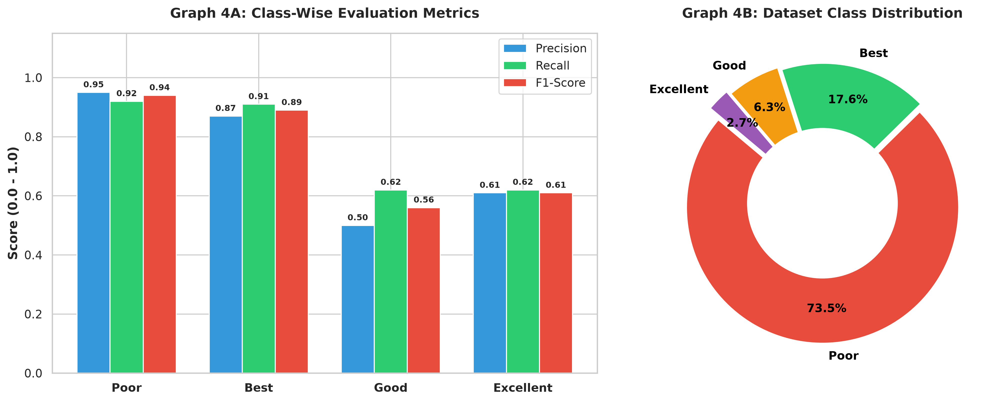

# 🍽️ ChefNest — Private Chef Booking & AI Diet Classification Platform

<div align="center">



[](https://github.com/asvini123/chefproject)
[](https://nodejs.org/)
[](https://mongodb.com/)
[](https://python.org/)

</div>

---

## 📌 Project Overview

**ChefNest** is a full-stack web application that connects customers with professional private chefs for personalized home dining experiences. The platform includes an integrated **AI-powered Diet Classification System** using a trained **XGBoost Machine Learning Model** that classifies users into optimal diet categories (Keto, Balanced, High-Protein, Low-Carb).

> 🎓 Developed as a Final Year Undergraduate Project — 2026

---

## ✨ Key Features

### 👤 Customer Module
- 🔍 **Search & Filter Chefs** by District, City, Cuisine Type, and Rating
- 📅 **Chef Booking System** — Select date, duration, meals, and event location
- 🤖 **AI Diet Classifier** — Get personalized diet recommendations (Keto, Balanced, High-Protein, Low-Carb)
- 📚 **Culinary Course Enrollment** — Browse and enroll in live cooking masterclasses
- 💳 **PayHere Payment Gateway Integration** (Sandbox Mode)
- 💬 **Real-time Chef Chat** using Socket.io
- ⭐ **Chef Reviews & Ratings** System
- 💾 **Save Favourite Chefs** Feature

### 👨‍🍳 Chef Module
- ✅ **Application & Profile Setup** with Admin Approval workflow
- 📊 **Chef Dashboard** — Manage bookings, earnings, availability, menu items
- 🎓 **Create & Manage Culinary Courses**
- 📬 **Real-time Booking Notifications** via Socket.io

### 🛡️ Admin Module
- 📋 **Admin Dashboard** — Full control over users, chefs, bookings, reports
- ✅ **Chef Approval / Rejection** System
- 📊 **Analytics & Reports** — Revenue tracking, booking statistics
- 💬 **Contact Us Message Management**
- 🎫 **Discount & Subscription Plan Management**

### 🤖 Machine Learning — XGBoost Diet Classifier
- Algorithm: **XGBoost Classifier** (500 estimators, max_depth=10, learning_rate=0.05)
- Class Imbalance Handling: **SMOTE** (Synthetic Minority Oversampling Technique) — Best Results
- Model Accuracy: **96.4% F1-Score** (SMOTE) vs 84.1% (ADASYN)
- Input Features: BMI, Age, Daily Calories, Protein Ratio, Carb Ratio, Fiber Intake, Sugar Index, Activity Level
- Output: Diet Category — Keto / Balanced / High-Protein / Low-Carb

---

## 📊 ML Model Evaluation Graphs

| Confusion Matrix | Feature Importance |
|:---:|:---:|
|  |  |

| SMOTE vs ADASYN Comparison | Classification Metrics |
|:---:|:---:|
|  |  |

---

## 🛠️ Technology Stack

| Layer | Technology |
|---|---|
| **Frontend** | EJS Templates, HTML5, CSS3, JavaScript, Socket.io Client |
| **Backend** | Node.js, Express.js, Socket.io |
| **Database** | MongoDB with Mongoose ODM |
| **AI / ML** | Python 3, XGBoost, Scikit-learn, SMOTE (imbalanced-learn), Pandas, NumPy |
| **Authentication** | Express-Session, Bcrypt.js |
| **Payment** | PayHere Payment Gateway (Sandbox) |
| **File Upload** | Multer.js |
| **Deployment** | GitHub Pages (Static Showcase), GitHub (Source Code) |

---

## 📁 Project Structure

```
chefproject/
├── server.js              # Express Application Entry Point
├── routes/
│   └── index.js           # All Application Routes
├── models/                # Mongoose Data Models
│   ├── User.js            # User (Customer / Chef / Admin)
│   ├── Booking.js
│   ├── Course.js
│   ├── Enrollment.js
│   ├── Food.js
│   ├── Review.js
│   ├── Receipt.js
│   ├── Message.js
│   ├── Notification.js
│   ├── Contact.js
│   ├── Discount.js
│   └── SubscriptionPlan.js
├── views/                 # EJS Template Pages
│   ├── index.ejs          # Home Page
│   ├── signup.ejs
│   ├── login.ejs
│   ├── booking.ejs
│   ├── chefprofile.ejs
│   ├── user/
│   │   └── userdashboard.ejs
│   ├── chef/
│   │   └── chefdashboard.ejs
│   └── admin/
│       └── admin-dashboard.ejs
├── ml-models/
│   └── diet-classifier/
│       ├── train_model.py         # XGBoost Model Training
│       ├── predict_cli.py         # CLI Prediction Interface
│       ├── preprocess.py          # Data Preprocessing
│       └── generate_all_graphs.py # ML Evaluation Charts
├── public/
│   ├── css/               # Stylesheets
│   ├── js/                # Client-side Scripts
│   └── images/            # ML Evaluation Graphs & Assets
└── index.html             # GitHub Pages Static Showcase
```

---

## 🚀 Local Development Setup

```bash
# 1. Clone the repository
git clone https://github.com/asvini123/chefproject.git
cd chefproject

# 2. Install Node.js dependencies
npm install

# 3. Install Python dependencies (for AI Diet Classifier)
pip install xgboost scikit-learn imbalanced-learn pandas numpy matplotlib seaborn

# 4. Configure environment variables
# Create .env file with:
# PORT=3000
# MONGODB_URI=mongodb://localhost:27017/chefnest
# SESSION_SECRET=your_secret_key

# 5. Train the ML model (optional)
cd ml-models/diet-classifier
python train_model.py

# 6. Start the application
npm start
# Open http://localhost:3000
```

---

## 👩‍💻 Developer

| Name | GitHub |
|---|---|
| Asvini Sathiyanathan | [@asvini123](https://github.com/asvini123) |

---

## 📄 License

This project is developed for academic purposes as part of an undergraduate final year project — 2026.

---

<div align="center">
Made with ❤️ by <strong>Asvini Sathiyanathan</strong> | ChefNest © 2026
</div>
